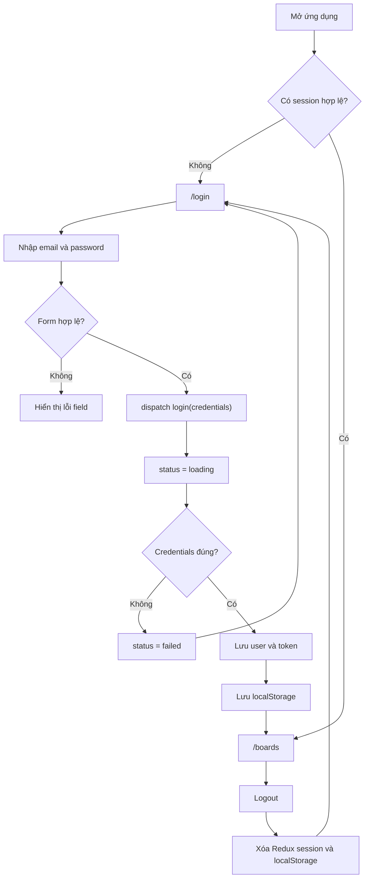
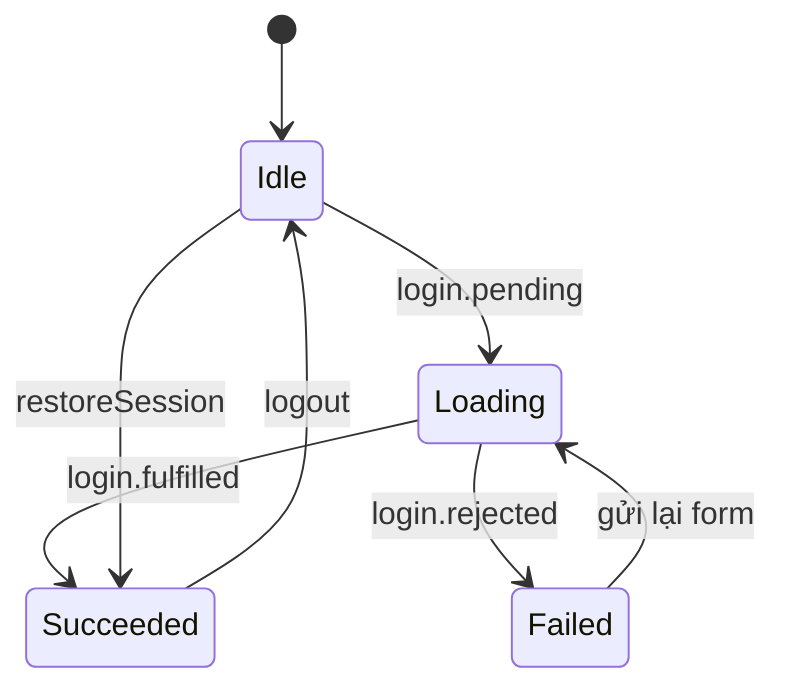

# Requirements

## Mục tiêu toàn dự án

Xây dựng ứng dụng quản lý công việc dạng Kanban để luyện:

- React hooks và custom hooks.
- Redux Toolkit, selector và middleware.
- RTK Query cho dữ liệu từ API.
- Phân biệt local state, global client state và server state.
- Tối ưu render dựa trên đo lường.

## Lộ trình

1. Authentication và protected routes.
2. Quản lý board.
3. Kanban list và card.
4. Chi tiết card, checklist và bình luận.
5. Tìm kiếm, bộ lọc và thông báo.
6. Tối ưu và kiểm thử.

---

# Milestone 01 — Authentication và Protected Routes

## Phạm vi

Milestone này chỉ triển khai đăng nhập giả lập, lưu phiên và bảo vệ route. Chưa làm board CRUD, RTK Query hoặc kéo thả.

Dependency được phép dùng: `@reduxjs/toolkit`, `react-redux` và `react-router-dom`.

Không thêm form library, validation library, authentication SDK hoặc backend.

## Luồng đăng nhập



## Tài khoản demo

```ts
const demoUser = {
  id: 'user-1',
  name: 'Hải Nguyễn',
  email: 'demo@trello.local',
  password: '123456',
}
```

Password chỉ dùng trong hàm mô phỏng đăng nhập, không lưu vào Redux hoặc `localStorage`.

## Routes

| Route | Quyền truy cập | Kết quả |
|---|---|---|
| `/` | Tất cả | Redirect theo trạng thái đăng nhập |
| `/login` | Chưa đăng nhập | Form đăng nhập |
| `/boards` | Đã đăng nhập | Danh sách board tĩnh |
| `/boards/demo` | Đã đăng nhập | Kanban hiện tại |
| `*` | Tất cả | Trang 404 |

Quy tắc:

- Chưa đăng nhập vào route riêng tư phải chuyển tới `/login`.
- Đã đăng nhập vào `/login` phải chuyển tới `/boards`.
- Sau đăng nhập, quay về URL người dùng đã yêu cầu trước đó.
- Refresh `/boards/demo` không mất phiên đăng nhập.
- Dùng `<Navigate>` cho redirect biểu diễn được bằng JSX; không dùng `window.location.href`.

## Redux state

```ts
type AuthUser = {
  id: string
  name: string
  email: string
}

type AuthState = {
  user: AuthUser | null
  token: string | null
  status: 'idle' | 'loading' | 'succeeded' | 'failed'
  error: string | null
}
```

Actions bắt buộc: `login.pending`, `login.fulfilled`, `login.rejected`, `logout` và `restoreSession`.

Selectors bắt buộc: `selectCurrentUser`, `selectAuthStatus`, `selectAuthError` và `selectIsAuthenticated`.

`selectIsAuthenticated` phải suy ra từ `user` và `token`; không lưu thêm `isAuthenticated` trong state.

## Async login

`createAsyncThunk` nhận `{ email, password }` và phải:

1. Giả lập request trong 500–800 ms.
2. So sánh credentials với tài khoản demo.
3. Credentials đúng trả về user không có password và token `demo-token`.
4. Credentials sai reject với `Email hoặc mật khẩu không chính xác`.
5. Pending đặt `status = loading` và xoá lỗi cũ.
6. Fulfilled lưu user/token và đặt `status = succeeded`.
7. Rejected xoá session, lưu lỗi và đặt `status = failed`.



## Persistence

Dùng key `trello.auth.v1` và chỉ lưu `{ user, token }`.

- Login thành công lưu session.
- Logout xoá session.
- Khởi động app đọc session và dispatch `restoreSession`.
- JSON hỏng hoặc thiếu `user/token` phải bị xoá mà không làm app crash.
- Không lưu password hoặc toàn bộ Redux store.
- Không dùng Redux Persist trong milestone này.

## Login page

Form gồm email, password, nút đăng nhập và thông tin tài khoản demo.

Validation:

- Email bắt buộc và đúng định dạng cơ bản.
- Password bắt buộc, tối thiểu 6 ký tự.
- Lỗi hiển thị dưới field tương ứng.
- Form không hợp lệ không được dispatch thunk.
- Khi loading, disable input và submit; nút hiển thị `Đang đăng nhập...`.

Accessibility:

- Mỗi input có label.
- Dùng `useId` nối label, input và error message.
- Input lỗi có `aria-invalid` và `aria-describedby`.
- Lỗi đăng nhập có `role="alert"`.

## Hooks bắt buộc

- `useState`: giá trị input và lỗi validation cục bộ.
- `useId`: ID form và error message.
- `useRef`: focus email sau khi đăng nhập thất bại.
- `useEffect`: side effect thật như title hoặc focus; không dùng để tính derived state hay redirect.
- `useAppDispatch` và `useAppSelector`: typed Redux hooks.
- `useAuth`: custom hook dùng tại Login, route guard và AppShell.

Không đưa draft form vào Redux và không thêm `useMemo`/`useCallback` nếu chưa có vấn đề render thực tế.

## Giao diện sau đăng nhập

- Header lấy tên và initials của user từ Redux.
- Có nút logout trong header hoặc sidebar.
- `/boards/demo` tái sử dụng `Board` hiện tại.
- `/boards` chỉ cần một board card tĩnh dẫn tới `/boards/demo`.
- Dữ liệu Kanban mẫu chưa đưa vào Redux.

## Tiêu chí nghiệm thu

- [ ] Login sai hiển thị đúng lỗi.
- [ ] Login đúng chuyển tới `/boards`.
- [ ] Không thể submit nhiều lần khi loading.
- [ ] Route riêng tư bị chặn khi chưa đăng nhập.
- [ ] Login thành công quay lại URL đã yêu cầu.
- [ ] Refresh không làm mất session.
- [ ] Logout xoá Redux state và localStorage.
- [ ] Đã đăng nhập không thể quay lại `/login`.
- [ ] Dữ liệu localStorage hỏng không làm app crash.
- [ ] Password không xuất hiện trong Redux DevTools hoặc localStorage.
- [ ] Không có lỗi TypeScript/console.
- [ ] `npm run build` thành công.

## Kiểm tra tối thiểu

Có một runnable test cho chuỗi reducer:

```text
login.pending → login.fulfilled → restoreSession → logout
```

State cuối phải bằng initial state và không còn `user/token`.

---

# Các vấn đề chưa giải quyết trong code hiện tại

Cập nhật lần cuối: **2026-08-17**.

Phần routing của Milestone 01 đã được triển khai với `/`, `/login`, `/boards`,
`/boards/demo`, route guard, guest guard và cơ chế lưu URL được yêu cầu trước
khi chuyển tới trang đăng nhập. Các mục dưới đây là những phần còn thiếu hoặc
chưa khớp với requirement.

## Ưu tiên cao — Hoàn thiện luồng authentication

- [ ] Đổi tài khoản demo trong `authApi.ts` về đúng requirement:
  `demo@trello.local` / `123456`.
- [ ] Đổi token trả về khi đăng nhập thành chính xác `demo-token`.
- [ ] Credentials sai phải reject với đúng thông báo
  `Email hoặc mật khẩu không chính xác`.
- [ ] Loại bỏ `password?: string` khỏi type `AuthUser`. Password chỉ được tồn
  tại trong dữ liệu mô phỏng nội bộ và không được phép xuất hiện trong kiểu
  user dùng bởi Redux hoặc persistence.
- [ ] Đảm bảo password không xuất hiện trong Redux DevTools. Hiện
  `createAsyncThunk` vẫn đưa credentials vào `action.meta.arg`.

## Ưu tiên cao — Nối persistence vào Login và Logout

- [ ] Sau login thành công, dùng `saveAuth({ user, token })` thay vì ghi trực
  tiếp key `auth` trong `Login.tsx`.
- [ ] Xoá đoạn `localStorage.setItem("auth", ...)` còn sót trong `Login.tsx`.
- [ ] Khi logout, gọi `clearStoredAuth()` để xoá key `trello.auth.v1` cùng lúc
  với việc xoá Redux state.
- [ ] Kiểm tra lại luồng: login → refresh `/boards/demo` → session vẫn còn.
- [ ] Kiểm tra lại luồng: logout → refresh → không khôi phục session cũ.

`getStoredAuth`, `restoreSession` và bước khởi động đọc session đã tồn tại;
JSON hỏng cũng đã được bắt lỗi và xoá an toàn. Phần còn thiếu là kết nối các
helper này vào luồng login/logout.

## Ưu tiên cao — Validation và accessibility của Login

- [x] Thêm local state cho lỗi email và password.
- [x] Validate email bắt buộc và đúng định dạng cơ bản trước khi dispatch.
- [x] Validate password bắt buộc và có ít nhất 6 ký tự trước khi dispatch.
- [x] Hiển thị lỗi ngay dưới field tương ứng.
- [x] Dùng `useId` để tạo ID cho input và error message.
- [x] Input lỗi phải có `aria-invalid` và `aria-describedby`.
- [x] Dùng `useRef` để focus lại email sau khi đăng nhập thất bại.
- [x] Dùng `useEffect` cho side effect thật, ví dụ cập nhật `document.title`
  hoặc xử lý focus sau lỗi đăng nhập.
- [x] Disable cả email, password và submit button khi `status === "loading"`.
- [x] Hiển thị thông tin tài khoản demo trên trang Login.
- [x] Form không hợp lệ tuyệt đối không được dispatch `login` thunk.

## Ưu tiên trung bình — Selectors và custom hook

- [ ] Thêm selector `selectCurrentUser`.
- [ ] Thêm selector `selectAuthStatus`.
- [ ] Thêm selector `selectAuthError`.
- [ ] Thêm selector `selectIsAuthenticated`; giá trị phải được suy ra từ
  `user` và `token`, không thêm field mới vào Redux state.
- [ ] Tạo custom hook `useAuth` và dùng tại Login, route guards và AppShell.
- [ ] Tránh destructure toàn bộ `state.auth` tại component khi chỉ cần một
  giá trị dẫn xuất.

## Ưu tiên trung bình — Header và Logout

- [ ] Lấy tên, email và initials trong `AppShell` từ current user của Redux;
  không hard-code `Hải Nguyễn`, `hai.nguyen@example.com` và `HN`.
- [ ] Sửa markup logout đang lồng `<button>` bên trong `<button>`. Chỉ giữ một
  button duy nhất và gắn `onClick={handleLogout}` vào button đó.
- [ ] Nút logout phải vừa dispatch `logout()` vừa xoá persisted session trước
  khi chuyển tới `/login`.
- [ ] Xác nhận logout bằng bàn phím hoạt động và không tạo React DOM nesting
  warning trong console.

## Ưu tiên trung bình — Kiểm thử và chất lượng

- [ ] Cài đặt test runner và thêm script `test` chạy được từ `package.json`.
- [ ] Viết reducer test tối thiểu cho chuỗi
  `login.pending → login.fulfilled → restoreSession → logout`.
- [ ] Kiểm tra state cuối bằng initial state và không còn `user/token`.
- [ ] Thêm test cho `getStoredAuth` với JSON hỏng, thiếu user và thiếu token.
- [ ] Bỏ `console.log` / `console.error` phục vụ debug khỏi luồng Login hoặc
  thay bằng cơ chế logging phù hợp.
- [ ] Xử lý React DOM warning do nested button trong menu tài khoản.
- [ ] Chạy lại toàn bộ checklist nghiệm thu sau khi hoàn tất các mục trên.

## Cần xác nhận về phạm vi dependency

- [ ] Requirement Milestone 01 chỉ cho phép Redux Toolkit, React Redux và
  React Router DOM, nhưng dự án hiện có thêm Axios và Tailwind CSS. Cần quyết
  định cập nhật requirement để chấp nhận các dependency này hoặc loại bỏ
  dependency không cần thiết trước khi nghiệm thu nghiêm ngặt.

## Những phần đã đạt, không cần làm lại

- [x] Có đúng shape cơ bản của `AuthState`.
- [x] Có typed hooks `useAppDispatch` và `useAppSelector`.
- [x] Login thunk mô phỏng delay 800 ms.
- [x] Pending xoá lỗi cũ; fulfilled lưu session vào Redux; rejected xoá
  user/token và đặt trạng thái failed.
- [x] Có action `restoreSession` và `logout`.
- [x] Có helper đọc/xoá JSON hỏng an toàn từ localStorage.
- [x] `/` redirect theo trạng thái đăng nhập.
- [x] Guest bị chặn khỏi private routes bằng `<Navigate>`.
- [x] User đã đăng nhập bị chuyển khỏi `/login`.
- [x] Login giữ và quay lại URL đã yêu cầu trước đó.
- [x] `/boards` có board card dẫn tới `/boards/demo`.
- [x] `/boards/demo` tái sử dụng Kanban hiện tại.
- [x] Có trang 404.
- [x] `npm run build` thành công tại lần kiểm tra gần nhất.
